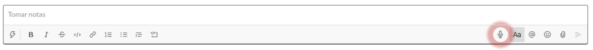

# slack-voice-message

Browser extension that allows to record voice messages in Slack!

> This project is based on other chrome extensions and ideas, but done the simple way!

Install in [Firefox](https://addons.mozilla.org/es/firefox/addon/voice-messages-for-slack/) and Chrome!



## Usage

Once this extension is installed, a new button with a microphone icon will be added to the message bar in Slack.


Just click the button with a microphone and record your voice message!


After, drag & drop downloaded audio file into a dialog in Slack and you are ready to send message!

Your recordings aren't sent anywhere and are only stored locally on your machine.

## Development

```sh
$ yarn
$ yarn dev
```

#### Using Chrome

After performing the steps described above,

1.  Open "chrome://extensions/" in Chrome
2.  Click "Load not packaged extension"
3.  Select any file in your add-on's root directory, `infovis/src/`

or run the following scripts,

```sh
$ yarn start:chrome # yarn start:chromium, for chromium
```

#### Using Firefox

```sh
$ yarn start:firefox # yarn start:nightly, for firefox nightly
```

## Extension build

```sh
$ yarn
$ yarn build
```
